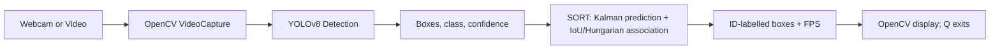

# Project Report: Real-Time Object Detection and Tracking

## Title

Real-Time Object Detection and Tracking using Python, OpenCV, YOLOv8, and SORT.

## Objective

Build a practical application that finds objects in webcam/video frames and assigns a persistent unique ID to each object while it is visible.

## Introduction

Object detection answers *what* and *where*: it outputs a class and bounding box. Object tracking additionally answers *which object is this over time*. This project combines a trained YOLOv8 detector with the lightweight SORT tracking algorithm.

## Problem Statement

Manual observation of live video is slow and inconsistent. A system is needed to locate common objects continuously, show confidence, and avoid recounting the same object in adjacent frames.

## Existing System

Basic OpenCV motion/background-subtraction systems detect movement but cannot reliably classify objects. Detection-only YOLO systems label every frame independently, so they do not provide stable identities.

## Proposed System

OpenCV captures frames, YOLOv8 detects COCO objects, and SORT associates detections between frames. The display overlays a class, confidence, bounding box, persistent ID, and FPS.

## Requirements

**Software:** Windows/Linux/macOS, Python 3.10+, OpenCV, Ultralytics, NumPy, SciPy, and a webcam or MP4 file.  
**Hardware:** 8 GB RAM recommended, ordinary webcam, dual-core CPU minimum; NVIDIA CUDA GPU recommended for higher FPS.

## System Architecture



## Algorithm

1. Open the selected camera or video and load YOLO weights.
2. Read and optionally resize a frame.
3. Run YOLO and retain detections above the confidence threshold.
4. Predict every existing track's next position using a constant-velocity Kalman filter.
5. Compute IoU for each predicted box/detection pair; Hungarian assignment selects the best non-conflicting matches.
6. Update matched tracks, create tracks for unmatched detections, remove stale tracks, and draw confirmed tracks.
7. Repeat until end of video or Q.

## Flowchart

```text
Start -> load model/open source -> read frame
  -> valid? --no--> end video/error -> release resources -> Stop
  -> YOLO detect -> SORT predict/match/update -> draw/FPS -> show frame
  -> Q pressed? --yes--> release resources -> Stop
              --no--> read frame
```

## Project Structure

`main.py` coordinates the program; `detector.py` wraps YOLO; `tracker.py` contains SORT; `utils/helpers.py` provides drawing and I/O validation; `models/` stores weights.

## Implementation and Code Explanation

The implementation is object-oriented in `YOLODetector`, `KalmanBoxTracker`, and `Sort`. `main.py` constructs them once, preventing repeated model loading. YOLO outputs `xyxy` boxes plus score/class. SORT converts each box to centre, area, and aspect ratio, predicts the next state, then corrects it when an IoU-matched detection arrives. Helper functions render the result. The code comments and README's source-code explanation map each file's statements to its role.

## Advantages

- Real-time friendly, modular, and easy to run.
- Pretrained YOLO recognises many COCO classes without custom training.
- SORT uses stable IDs with low computation.
- Handles common camera/file/model failures cleanly.

## Limitations

- YOLO may fail on tiny, occluded, unusual, or poorly lit objects.
- SORT uses only motion and overlap, so IDs can switch during long occlusions or close crossings.
- COCO labels may not match a specialized domain.
- CPU inference speed depends strongly on resolution and hardware.

## Future Scope

Use Deep SORT/ByteTrack appearance features, train on custom data, add zones/counting, event logging, multi-camera synchronization, a GUI, GPU deployment, and privacy-aware data retention.

## Applications

Traffic analytics, retail footfall estimation, workplace safety, smart surveillance, sports analysis, warehouse monitoring, and robotics.

## Conclusion

The project demonstrates the full video analytics pipeline: capture, neural detection, temporal association, visualisation, and safe shutdown. Its modular design lets beginners replace the model or add domain logic incrementally.

## References

1. Ultralytics, [YOLO documentation](https://docs.ultralytics.com/).
2. Bewley et al., [Simple Online and Realtime Tracking](https://arxiv.org/abs/1602.00763), 2016.
3. OpenCV, [Video I/O documentation](https://docs.opencv.org/).
